# FacePhys Demo

**Live Demo:** https://kegangwangccnu.github.io/FacePhys-Demo/
> *Note: A proxy might be required in restricted network regions.*
## Overview

FacePhys Demo is a browser-based remote photoplethysmography (rPPG) monitor. It uses State Space Models (SSMs) to extract heart rate and heart rate variability from facial video feeds via a standard webcam.

The application runs inference locally using LiteRT and WebAssembly. It is designed for edge environments, offering low latency (~5ms) with a model size of approximately 4MB.

## Privacy

* **Zero Data Upload:** All inference occurs on-device.
* **No Cloud Processing:** Video data and physiological signals are never transmitted to a server.
* **Offline Capable:** The application functions without an internet connection once loaded.

## Features

* **State Space Models:** Models heart dynamics as continuous-time controlled ODEs to handle irregular sampling.
* **Multi-threaded Architecture:** Uses Web Workers for inference, PSD calculation, and plotting to maintain UI responsiveness.
* **Visualization:** Displays real-time attention heatmaps, 3D state trajectories, and BVP/PSD waveforms.
* **Interface:** Windows 95/98 style UI.

## Installation (PWA)

This project is a Progressive Web App (PWA) and can be installed as a standalone application.

### Desktop (Chrome / Edge)
1.  Open the [website](https://kegangwangccnu.github.io/FacePhys-Demo/).
2.  Click the Install icon in the address bar.

### Mobile (Android / iOS)
Scan the QR code below to access the application on your mobile device:

#### Android
1.  Open the scanned link in Chrome.
2.  Open the menu and select **Add to Home screen** or **Install App**.

#### iOS
1.  Open the scanned link in Safari.
2.  Tap the Share button and select **Add to Home Screen**.

## License

MIT License with Privacy Protection Addendum — see [LICENSE](LICENSE) for details.
